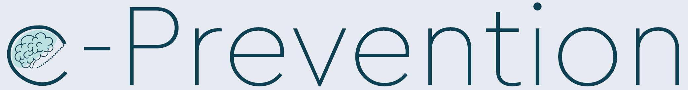
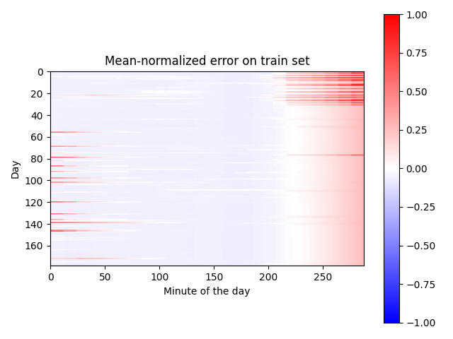
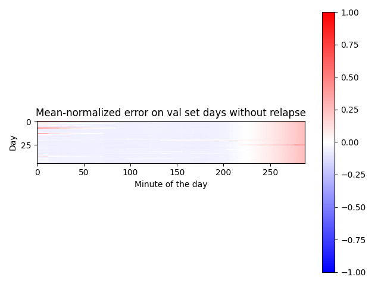
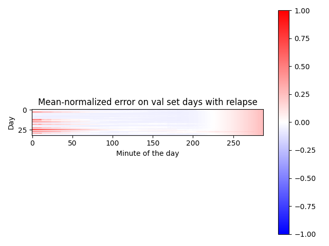

## SPGC ICASSP 2024 Submission
### Patient-Specific Modeling of Daily Activity Patterns for Unsupervised Detection of Psychotic and Non-Psychotic Relapses

<div align="center">


</div>
<br/>

This repository contains the source code for our submission to the `The 2nd e-Prevention challenge: Psychotic and Non-Psychotic Relapse Detection using Wearable-Based Digital Phenotyping` organized in context of [ICASSP 2024](https://2024.ieeeicassp.org/). 
The Challenge website can be found in [https://robotics.ntua.gr/icassp2024-eprevention-spgc/](https://robotics.ntua.gr/icassp2024-eprevention-spgc/).

Our final submission ranked **3rd** on detecting non-psychotic relapses (Track 1) and **1st** on detecting psychotic relapses (Track 2).
The accompanying publication of our approach can be found in:
```
A. Hein, S. Gronauer and K. Diepold
Patient-Specific Modeling of Daily Activity Patterns for Unsupervised Detection of Psychotic and Non-Psychotic Relapses
International Conference on Acoustics, Speech and Signal Processing, 2024.
```

An overview of the challenge is given in:
```
P. P. Filntisis, N. Efthymiou, G. Retsinas, A. Zlatintsi, C. Garoufis, T. Sounapoglou, P. Tsanakas, N. Smyrnis, and P. Maragos, 
The 2nd e-Prevention challenge: Psychotic and Non-Psychotic Relapse Detection using Wearable-Based Digital Phenotyping, 
In: Proc. International Conference on Acoustics, Speech and Signal Processing, 2024.
```


## Our Approach
Changes made to the challenge baseline (which can be found here: https://github.com/filby89/spgc-eprevention-icassp2024):

**Pre-Processing**

 - Added step data
 - Only for Track1: Instead of ignoring parts of the day where data is missing, impute with the feature's median for *the specific 5-minute segment of the day* in question, for that patient


**Model**

 - Instead of training the model to predict the user ID, change the objective to predicting the time stamps (minute of the day) of the sequence, based on  the input features. The idea behind this is that a relapse may lead to changes in a patient's daily routine, which will then be reflected in the model's prediction error.
 - Change `dim_feedforward_encoder` from `2048` to `64`
 - Change `d_model` from `32` to `64`

**Training**

 - Train a separate model for each patient. Analogous to the baseline, check the relapse detection accuracy on the validation set after each epoch and save a model if it surpasses the best score so far. 
 - Use a sequence length of 72 for Track 1 and a sequence length of 24 for Track 2


**Outlier Detection**

Instead of using an Elliptic Envelope detector, collect the mean prediction error for each day in the training set and the validation set. For each day in the validation set, calculate the mean-normalized prediction error:
$$ 
e_{\text{norm}} = \frac{{e_{\text{val}} - \overline{e}_{\text{train}}}}{\text{max}(e_{\text{train}}) -\text{min}(e_{\text{train}})} 
$$

Designate any day with a normalized prediction error above 0 as a relapse day:

$$
\mathrm{score}(e_{\text{norm}}) = \begin{cases}
    0 & \text{if } e_{\text{norm}} \leq 0 \\
    1 & \text{if } e_{\text{norm}} > 0 
\end{cases}
$$

## Installation
Create a new conda environment:

```bash
conda create -n spgc python=3.9
conda activate spgc
```

Install the requirements:

```bash
pip install -r requirements.txt
```


## Training

For reproducing our results, please checkout the branch `track1` or `track2` and follow the training instructions given in the respective `README.md`. 

## Results
### Metrics
For both tracks, the evaluation of the state of the patient as stable or relapsing will be carried out on a daily basis. Since this is an anomaly detection task, the average of the PR-AUC and ROC-AUC scores over the daily predictions will be utilized as the final evaluation metrics. Participants can evaluate the effectiveness of their approach using the same metrics on the validation set. 

This repository holds the code needed to evaluate the solution. Note that the PR-AUC, ROC-AUC scores will be macro-averaged. This means that we will first calculate the PR-AUC, ROC-AUC scores for each patient, get the mean across all patients, and finally average the two values. The formula is:

$$
\begin{equation}
pr_{auc} = \frac{1}{N} \sum_{i=1}^{N} pr_{auc}^i
\end{equation}
$$
$$
\begin{equation}
roc_{auc} = \frac{1}{N} \sum_{i=1}^{N} roc_{auc}^i
\end{equation}
$$
$$
\begin{equation}
avg = \frac{pr_{auc} + roc_{auc}}{2}
\end{equation}
$$

where `N` is the number of patients in the dataset.


Our results on the **validation** set after applying all proposed changes (averaged over 5 runs):


| Track 1       | PR-AUC | ROC-AUC | AVG |  
|---------------|--------|---------|-----|  
| Random Chance | 0.326 | 0.500 | 0.413 |  
| Baseline      | 0.472 | 0.614 | 0.543 |
| *Ours*        | *0.680* | *0.665* | *0.672* |

| Track 2       | PR-AUC | ROC-AUC | AVG |  
|---------------|--------|---------|-----|  
| Random Chance | 0.349 | 0.500 | 0.424 |  
| Baseline      | 0.452 | 0.594 | 0.522 |
| *Ours*        | *0.694* | *0.669* | *0.6812* |

### Visualizations

Example visualization for the model's prediction error for patient 5 in track 1. The error is shown per 5-minute segment, i.e., there are 288 (24 * 60 / 5) segments per day. Where the model makes predictions on overlapping segments, they were averaged. The plots show that, in this case, the prediction error is lower on validation set days without relapses. Many relapse days show errors especially after midnight and in the early hours of the morning, indicating a change in activity pattern. 








### References


```
@article{zlatintsi2022prevention,
  title={E-prevention: Advanced support system for monitoring and relapse prevention in patients with psychotic disorders analyzing long-term multimodal data from wearables and video captures},
  author={Zlatintsi, Athanasia and Filntisis, Panagiotis P and Garoufis, Christos and Efthymiou, Niki and Maragos, Petros and Menychtas, Andreas and Maglogiannis, Ilias and Tsanakas, Panayiotis and Sounapoglou, Thomas and Kalisperakis, Emmanouil and others},
  journal={Sensors},
  volume={22},
  year={2022},
}

@inproceedings{retsinas2020person,
  title={Person identification using deep convolutional neural networks on short-term signals from wearable sensors},
  author={Retsinas, George and Filntisis, Panayiotis Paraskevas and Efthymiou, Niki and Theodosis, Emmanouil and Zlatintsi, Athanasia and Maragos, Petros},
  booktitle={ICASSP 2020-2020 IEEE International Conference on Acoustics, Speech and Signal Processing (ICASSP)},
  year={2020},
}

@inproceedings{panagiotou2022comparative,
  title={A comparative study of autoencoder architectures for mental health analysis using wearable sensors data},
  author={Panagiotou, M and Zlatintsi, A and Filntisis, PP and Roumeliotis, AJ and Efthymiou, N and Maragos, P},
  booktitle={2022 30th European Signal Processing Conference (EUSIPCO)},
  year={2022},
}


@article{efthymioudigital,
  title={From Digital Phenotype Identification To Detection Of Psychotic Relapses},
  author={Efthymiou, Niki and Retsinas, George and Filntisis, Panagiotis P and Garoufis, Christos and Zlatintsi, Athanasia and Kalisperakis, Emmanouil and Garyfalli, Vasiliki and Karantinos, Thomas and Lazaridi, Marina and Smyrnis, Nikolaos and Maragos, Petros}
  booktitle={2023 IEEE International Conference on Health Informatics (ICHI)},
 year={2023},
}
```


### Rules, Requirements and Licensing

Participating teams are allowed to compete in any or both tracks; however, all participants should not be included in more than one team. Αfter the completion of the challenge, the top-scoring teams for each track will be declared the winners of their respective track. Furthermore, the top-5 performing teams will be required to provide a synopsis of their proposed methodology and results in a two-page paper and present it in person to the Special Session dedicated to this challenge at the ICASSP-2024 conference.

Permission is granted to use the data, given that you agree: 1. To include a reference to the e-Prevention Dataset in any work that makes use of the dataset. For research papers, cite our preferred publication as it will be listed on our website and our challenge overview paper (to be released later). 2. That you do not distribute this dataset or modified versions. 3. That you may not use the dataset or any derivative work for commercial purposes, such as, for example, licensing or selling the data or using the data with the purpose of procuring a commercial gain. 4. That all rights not expressly granted to you are reserved by the e-Prevention SP Grand Challenge 2024 organizers.


### Organizing Team
P. P. Filntisis<sup>1</sup>, N. Efthymiou<sup>1</sup>, G. Retsinas<sup>1</sup>, A. Zlatintsi<sup>1</sup>, C. Garoufis<sup>1</sup>, T. Sounapoglou<sup>2</sup>, P. Tsanakas<sup>1</sup>, N. Smyrnis<sup>3</sup>, and P. Maragos<sup>1</sup>

<sup>1</sup> School of ECE (CVSP / IRAL Group), National Technical University of Athens, Athens, Greece  
<sup>2</sup> BLOCKACHAIN PC, Thessaloniki, Greece  
<sup>3</sup> National & Kapodistrian University of Athens, Medical School, Athens, Greece


### Acknowledgements
Funding: This research has been financed by the European Regional Development Fund of the European Union and Greek national funds through the Operational Program Competitiveness, Entrepreneurship and Innovation, under the call RESEARCH–CREATE–INNOVATE (project acronym: e-Prevention, code: T1EDK-02890/MIS: 5032797).

This repository has borrowed code from the winning solution of the second track of the 1st e-Prevention Challenge which can be found [here](https://github.com/perceivelab/e-prevention-icassp-2023).

Link to previous challenge: [https://robotics.ntua.gr/eprevention-sp-challenge/](https://robotics.ntua.gr/eprevention-sp-challenge/)
